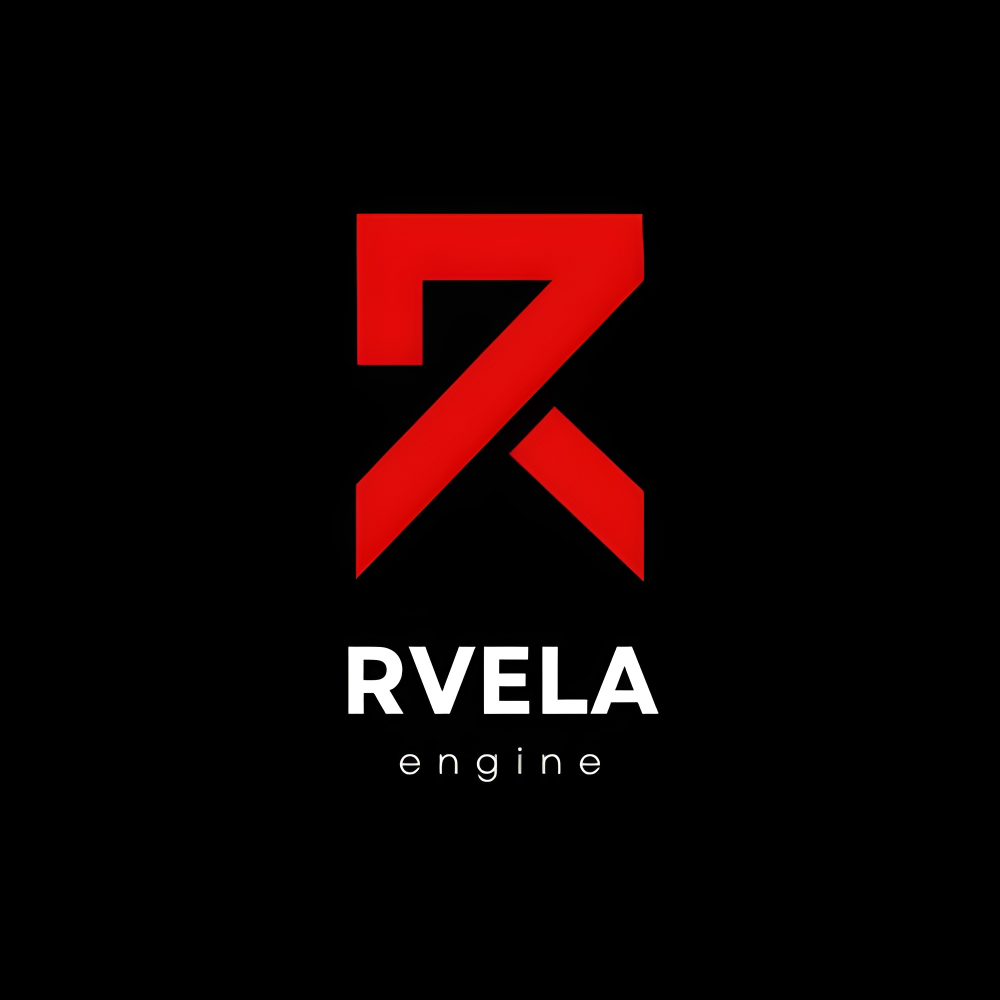
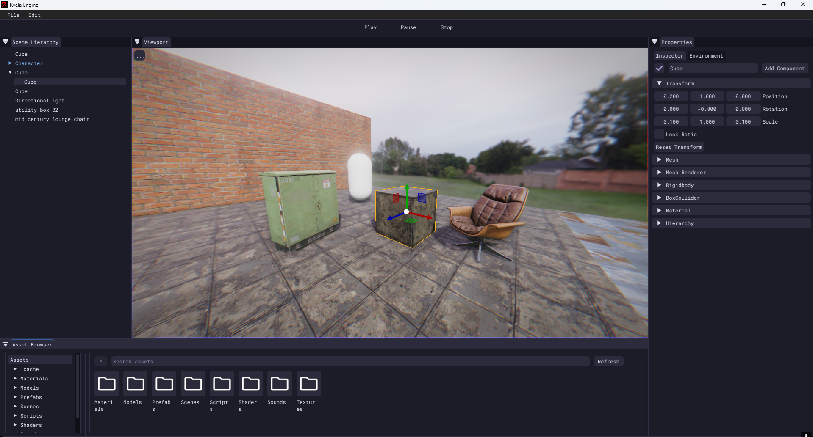
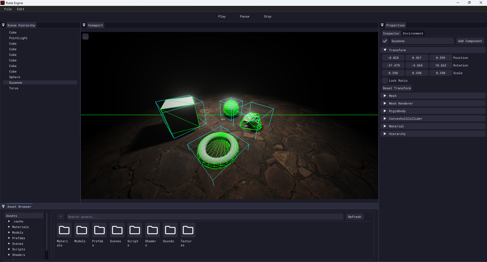

# Rvela Engine

Rvela is a 3D game engine written in C++. This project is mainly designed for learning purposes.

The engine is built around an ECS architecture and focuses on keeping systems modular and data-oriented where possible.




## Screenshots
  
  

## Features

- Graphics API: OpenGL  
- PBR rendering pipeline  
- ECS architecture  
- Asset system and import pipeline
  - Texture compression
  - Mesh optimization
- Material system  
- Scene hierarchy and serialization  
- Logging  
- Lua scripting  
- Physics  
- Audio system  

## Used Dependencies
- [ImGui](https://github.com/ocornut/imgui)  
- [Assimp](https://github.com/assimp/assimp)  
- [ImGuizmo](https://github.com/CedricGuillemet/ImGuizmo)  
- [ImGuiFileDialog](https://github.com/aiekick/ImGuiFileDialog)  
- [Entt](https://github.com/skypjack/entt)  
- [GLAD](https://github.com/Dav1dde/glad)  
- [GLFW](https://www.glfw.org/)  
- [GLM](https://github.com/g-truc/glm)  
- [stb_image](https://github.com/nothings/stb)  
- [JolyPhysics](https://github.com/jrouwe/JoltPhysics)  
- [Lua](https://github.com/lua/lua)  
- [Sol2](https://github.com/ThePhD/sol2)  
- [meshoptimizer](https://github.com/zeux/meshoptimizer)  
- [DirectXTex](https://github.com/microsoft/DirectXTex)  
- [miniaudio](https://github.com/mackron/miniaudio)  
- [nlohmann_json](https://github.com/nlohmann/json)  
- [tsl-robin-map](https://github.com/Tessil/robin-map)  
- [spdlog](https://github.com/gabime/spdlog)  
- [tinyobjloader](https://github.com/tinyobjloader/tinyobjloader)  
- [uuid_v4](https://github.com/crashoz/uuid_v4)   


## Build

To get the project up and running, you'll need to follow the setup instructions for your platform.

#### For Windows
1. Navigate to the `Scripts` folder in the project directory.
2. Run the `Setup-Windows.bat` batch file.

#### For Linux

1. Navigate to the `Scripts` folder in the project directory.

2. Make the `Setup-Linux.sh` script executable:
   
   ```bash
   chmod +x Setup-Linux.sh
3. Run the script to install necessary dependencies and set up the project:
   ```bash
   ./Setup-Linux.sh


## Roadmap (TODO)

- Particle system  
- Animation system  
- Ingame UI  
